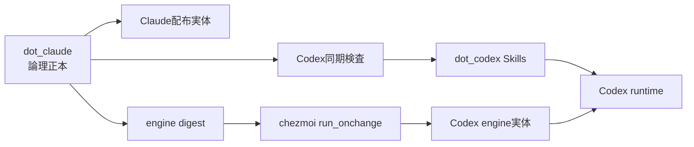
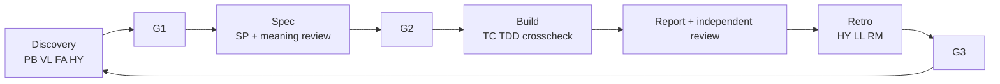
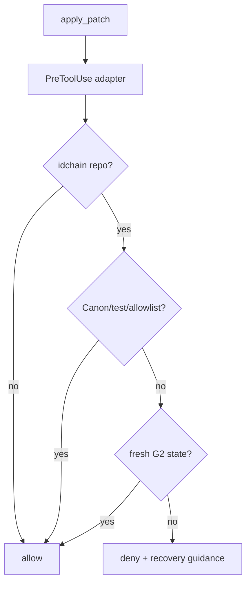

# idchain 構成図

## 正本からホスト別配布まで

```mermaid
flowchart LR
    S["dot_claude<br/>論理正本"] --> C["Claude配布実体"]
    S --> T["Codex同期検査"]
    T --> K["dot_codex Skills"]
    S --> D["engine digest"]
    D --> R["chezmoi run_onchange"]
    R --> E["Codex engine実体"]
    K --> X["Codex runtime"]
    E --> X
```

## 開発ライフサイクル

```mermaid
flowchart LR
    D["Discovery<br/>PB VL FA HY"] --> G1["G1"]
    G1 --> S["Spec<br/>SP + meaning review"]
    S --> G2["G2"]
    G2 --> B["Build<br/>TC TDD crosscheck"]
    B --> V["Report + independent review"]
    V --> R["Retro<br/>HY LL RM"]
    R --> G3["G3"]
    G3 --> D
```

## Codex編集ゲート

```mermaid
flowchart TD
    P["apply_patch"] --> H["PreToolUse adapter"]
    H --> I{"idchain repo?"}
    I -- "no" --> A["allow"]
    I -- "yes" --> L{"Canon/test/allowlist?"}
    L -- "yes" --> A
    L -- "no" --> G{"fresh G2 state?"}
    G -- "yes" --> A
    G -- "no" --> N["deny + recovery guidance"]
```
