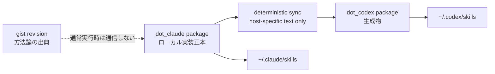
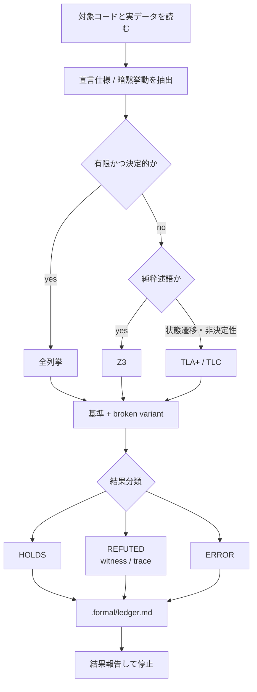

# z3-tla-playbook アーキテクチャ図

## 配布

```mermaid
flowchart LR
  G["gist revision<br/>方法論の出典"] -. "通常実行時は通信しない" .-> C["dot_claude package<br/>ローカル実装正本"]
  C --> S["deterministic sync<br/>host-specific text only"]
  S --> X["dot_codex package<br/>生成物"]
  C --> H1["~/.claude/skills"]
  X --> H2["~/.codex/skills"]
```

## デバッグフロー

```mermaid
flowchart TD
  R["対象コードと実データを読む"] --> E["宣言仕様 / 暗黙挙動を抽出"]
  E --> F{"有限かつ決定的か"}
  F -- "yes" --> B["全列挙"]
  F -- "no" --> P{"純粋述語か"}
  P -- "yes" --> Z["Z3"]
  P -- "状態遷移・非決定性" --> T["TLA+ / TLC"]
  B --> V["基準 + broken variant"]
  Z --> V
  T --> V
  V --> O{"結果分類"}
  O --> H["HOLDS"]
  O --> X["REFUTED<br/>witness / trace"]
  O --> Q["ERROR"]
  H --> L[".formal/ledger.md"]
  X --> L
  Q --> L
  L --> STOP["結果報告して停止"]
```
